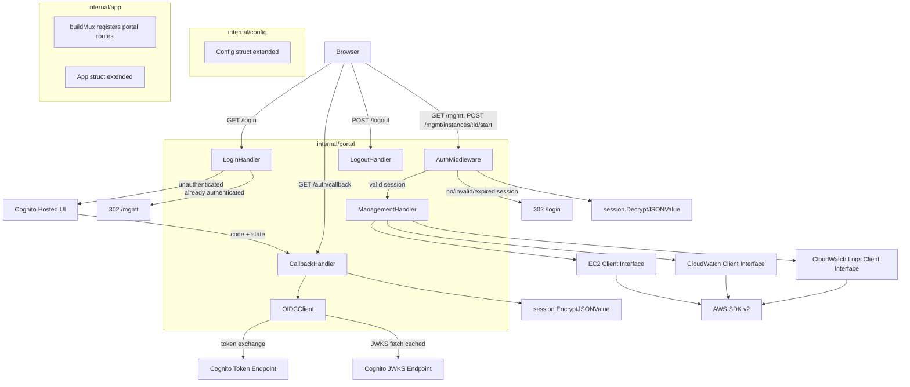

# Design Document: EC2 Management Portal

## Overview

The EC2 Management Portal adds a protected administration section to the existing Go + Templ + HTMX portfolio web application. It exposes three new route families — `/login` and `/auth/callback` (unauthenticated OAuth flow) and `/mgmt/*` (authenticated management) — and enables operators to manage EC2 instance lifecycle and observe metrics and logs directly from the browser.

Authentication is fully delegated to AWS Cognito via the OAuth 2.0 Authorization Code + PKCE flow. The application never sees or stores operator passwords. After successful Cognito authentication, the application validates the returned ID token (JWT), creates an AES-256-GCM encrypted session cookie, and redirects the operator to the dashboard.

The portal reuses existing infrastructure: AES-256-GCM cookie encryption from `internal/session`, the `httpx.NewSecureCookie` / `httpx.ClientIP` helpers, and the `config.Load()` / `App` wiring pattern. It is modeled directly after the `internal/soccer` package.

The portal is entirely opt-in: all routes are registered only when `PortalEnabled()` is true. A misconfigured portal never affects the existing portfolio or soccer routes.

---

## Architecture



The flow for a first-time login:

1. Browser `GET /login` → `LoginPageHandler` generates PKCE `code_verifier` + `state`, stores them in the `mgmt_oauth_state` cookie, redirects to Cognito Hosted UI.
2. Operator authenticates with Cognito; Cognito redirects to `GET /auth/callback?code=...&state=...`.
3. `CallbackHandler` validates `state` against cookie, calls `OIDCClient.ExchangeCode`, validates the returned ID token JWT via `OIDCClient.ValidateIDToken` (JWKS-backed), extracts the operator's email/username, sets the `mgmt_session` cookie, clears `mgmt_oauth_state`, redirects to `/mgmt`.

The flow for an authenticated action request:

1. Browser sends `POST /mgmt/instances/{id}/start` with the `mgmt_session` cookie.
2. `requireAuth` middleware decrypts and validates the session; injects username into `context.Context`.
3. `InstanceActionHandler` validates the instance ID regex; calls `EC2Client.StartInstances`.
4. Returns an HTMX-compatible HTML fragment.

---

## Components and Interfaces

### `internal/config/config.go` — Config extensions

```go
// Added to Config:
// PortalSessionKey        []byte  // 32 bytes decoded from MGMT_SESSION_KEY (64-char hex)
// PortalCognitoDomain     string  // from MGMT_COGNITO_DOMAIN
// PortalCognitoClientID   string  // from MGMT_COGNITO_CLIENT_ID
// PortalCognitoRedirectURI string // from MGMT_COGNITO_REDIRECT_URI
// PortalCognitoLogoutURI  string  // from MGMT_COGNITO_LOGOUT_URI (optional)
// PortalAWSRegion         string  // from MGMT_AWS_REGION, defaults to "us-east-1"
// portalEnabled           bool    // computed at Load() time
```

`config.Load()` is extended to:
- Read `MGMT_SESSION_KEY`; if absent or empty → `portalEnabled = false`, no warning. If present but invalid 64-char hex → `portalEnabled = false`, WARN log.
- Read `MGMT_COGNITO_DOMAIN` and `MGMT_COGNITO_CLIENT_ID`; if either is empty while session key is valid → `portalEnabled = false`, WARN log.
- Read `MGMT_COGNITO_REDIRECT_URI` and `MGMT_COGNITO_LOGOUT_URI` (optional).
- Read `MGMT_AWS_REGION`; default to `"us-east-1"` if absent.
- Emit a single INFO log: `portal_enabled`, `aws_region`.

New method on `*Config`:

```go
func (c *Config) PortalEnabled() bool { return c.portalEnabled }
```

`PortalEnabled()` returns true only when `MGMT_SESSION_KEY` is valid AND `MGMT_COGNITO_DOMAIN` is non-empty AND `MGMT_COGNITO_CLIENT_ID` is non-empty.

### `internal/config/constants.go` — new constants

```go
const (
    PortalSessionCookieName    = "mgmt_session"
    PortalCookiePath           = "/"
    PortalSessionTTL           = 12 * time.Hour
    PortalOAuthStateCookieName = "mgmt_oauth_state"
    PortalOAuthStateCookieTTL  = 10 * time.Minute
    DefaultPortalAWSRegion     = "us-east-1"
)
```

### `internal/portal/handler.go` — Handler struct

```go
type Handler struct {
    Config     *config.Config
    OIDC       *OIDCClient
    EC2        EC2ClientIface
    CloudWatch CloudWatchClientIface
    Logs       CloudWatchLogsClientIface
    Logger     *slog.Logger
}

func NewHandler(cfg *config.Config, oidc *OIDCClient,
    ec2 EC2ClientIface, cw CloudWatchClientIface, logs CloudWatchLogsClientIface,
    logger *slog.Logger) *Handler
```

Cookie/session helpers (private):

```go
func (h *Handler) setSession(w http.ResponseWriter, r *http.Request, s *PortalSession) error
func (h *Handler) loadSession(r *http.Request) (*PortalSession, error)
func (h *Handler) clearSession(w http.ResponseWriter, r *http.Request)
```

### `internal/portal/auth.go` — Auth handlers and middleware

```go
func (h *Handler) LoginPageHandler(w http.ResponseWriter, r *http.Request)
// GET /login: if valid session → redirect /mgmt; else generate PKCE code_verifier + state,
// store in mgmt_oauth_state cookie, redirect to Cognito authorization endpoint.

func (h *Handler) CallbackHandler(w http.ResponseWriter, r *http.Request)
// GET /auth/callback: validate state cookie; exchange code for tokens via Cognito token endpoint;
// validate ID token JWT (signature via JWKS, iss, aud, exp); extract email/username;
// set session cookie; clear mgmt_oauth_state cookie; redirect to /mgmt.

func (h *Handler) LogoutHandler(w http.ResponseWriter, r *http.Request)
// POST /logout: clear session cookie; redirect to Cognito logout endpoint if configured,
// else redirect to /login.

func (h *Handler) requireAuth(next http.HandlerFunc) http.HandlerFunc
```

`requireAuth` injects the username into context using a typed key:

```go
type contextKey string
const portalUsernameKey contextKey = "portal_username"

func UsernameFromContext(ctx context.Context) (string, bool)
```

### `internal/portal/oidc.go` — OIDC/OAuth helpers

New file providing all Cognito OAuth 2.0 / JWKS functionality:

```go
type OIDCClient struct {
    CognitoDomain string
    ClientID      string
    RedirectURI   string
    LogoutURI     string
    jwksCache     *jwksCache // internal
}

func NewOIDCClient(domain, clientID, redirectURI, logoutURI string) *OIDCClient

func (c *OIDCClient) AuthorizationURL(state, codeChallenge string) string
// Builds the Cognito authorization endpoint URL with all required params:
// response_type=code, scope=openid email profile, client_id, redirect_uri, state, code_challenge,
// code_challenge_method=S256.

func (c *OIDCClient) ExchangeCode(ctx context.Context, code, codeVerifier string) (*TokenResponse, error)
// POSTs to the Cognito token endpoint; returns ID token, access token, refresh token.

func (c *OIDCClient) ValidateIDToken(ctx context.Context, rawIDToken string) (*Claims, error)
// Fetches JWKS (from cache), verifies signature, iss, aud, exp; returns claims.

func (c *OIDCClient) LogoutURL() string
// Returns the Cognito logout endpoint URL with client_id and logout_uri params.

type TokenResponse struct {
    IDToken      string `json:"id_token"`
    AccessToken  string `json:"access_token"`
    RefreshToken string `json:"refresh_token"`
    ExpiresIn    int    `json:"expires_in"`
}

type Claims struct {
    Sub      string `json:"sub"`
    Email    string `json:"email"`
    Username string `json:"cognito:username"`
    Issuer   string `json:"iss"`
    Audience string `json:"aud"`
    Expiry   int64  `json:"exp"`
}

type jwksCache struct {
    mu        sync.RWMutex
    keys      map[string]crypto.PublicKey // kid → public key
    fetchedAt time.Time
    ttl       time.Duration              // 1 hour
    fetchFn   func(ctx context.Context) ([]jwk, error)
}
```

PKCE helpers (pure functions, no side effects):

```go
func generateCodeVerifier() (string, error) // 32 random bytes → base64url (no padding)
func codeChallenge(verifier string) string   // SHA-256 → base64url (no padding)
func generateState() (string, error)         // 16 random bytes → hex string
```

JWT validation uses `github.com/golang-jwt/jwt/v5` (pure Go, no CGO, widely used in the Go ecosystem). JWKS fetching uses a plain `http.Client` GET to `{CognitoDomain}/.well-known/jwks.json`.

### `internal/portal/mgmt.go` — Management handlers

```go
func (h *Handler) DashboardHandler(w http.ResponseWriter, r *http.Request)
func (h *Handler) InstanceActionHandler(w http.ResponseWriter, r *http.Request)
func (h *Handler) MetricsHandler(w http.ResponseWriter, r *http.Request)
func (h *Handler) LogsHandler(w http.ResponseWriter, r *http.Request)
```

Instance ID validation is compiled once at package init:

```go
var instanceIDRegex = regexp.MustCompile(`^i-[0-9a-f]{8,17}$`)
```

### `internal/portal/ec2.go` — AWS client interfaces

```go
type EC2ClientIface interface {
    DescribeInstances(ctx context.Context, input *ec2.DescribeInstancesInput, ...) (*ec2.DescribeInstancesOutput, error)
    StartInstances(ctx context.Context, input *ec2.StartInstancesInput, ...) (*ec2.StartInstancesOutput, error)
    StopInstances(ctx context.Context, input *ec2.StopInstancesInput, ...) (*ec2.StopInstancesOutput, error)
}

type CloudWatchClientIface interface {
    GetMetricStatistics(ctx context.Context, input *cloudwatch.GetMetricStatisticsInput, ...) (*cloudwatch.GetMetricStatisticsOutput, error)
}

type CloudWatchLogsClientIface interface {
    FilterLogEvents(ctx context.Context, input *cwlogs.FilterLogEventsInput, ...) (*cwlogs.FilterLogEventsOutput, error)
}
```

Real implementations are thin wrappers constructed in `internal/app/app.go` using `aws-sdk-go-v2/config.LoadDefaultConfig`.

### `internal/portal/page.go` — Templ rendering helpers

Thin wrappers that call `templ.Component.Render(ctx, w)` and return errors for consistent handling:

```go
func (h *Handler) renderErrorPage(w http.ResponseWriter, r *http.Request, props ErrorPageProps)
func (h *Handler) renderDashboard(w http.ResponseWriter, r *http.Request, props DashboardProps)
func (h *Handler) renderFragment(w http.ResponseWriter, r *http.Request, c templ.Component)
```

### Templ components

| File | Component | Purpose |
|---|---|---|
| `cmd/web/pages/portal_error.templ` | `PortalError(props)` | OAuth error page (400/401/503) with "Try again" link to `/login` |
| `cmd/web/pages/portal_mgmt.templ` | `PortalDashboard(props)` | Management dashboard with instance table |
| `cmd/web/partials/portal_fragments.templ` | `InstanceRow(...)` | Single instance row fragment |
| | `ActionResult(...)` | Success/error result for instance action |
| | `MetricsTable(...)` | CPU utilization data table |
| | `LogsList(...)` | Log events list (up to 100, reverse-chronological) |

Note: `portal_login.templ` is not needed — Cognito provides the hosted login UI. The application only needs `portal_error.templ` for OAuth failure cases.

### `internal/app/app.go` — App struct extension

`App` gains a `PortalHandler *portal.Handler` field. The portal handler (including the `OIDCClient` and AWS clients) is constructed in `New()` only when `cfg.PortalEnabled()` is true.

### `internal/app/server.go` — Route registration

In `buildMux()`, after existing routes, guarded by `app.Config.PortalEnabled()`:

```go
if app.Config.PortalEnabled() {
    ph := app.PortalHandler
    mux.HandleFunc("GET /login",          ph.LoginPageHandler)
    mux.HandleFunc("GET /auth/callback",  ph.CallbackHandler)
    mux.HandleFunc("POST /logout",        ph.LogoutHandler)
    mux.HandleFunc("GET /mgmt",           ph.requireAuth(ph.DashboardHandler))
    mux.HandleFunc("POST /mgmt/instances/{id}/start",   ph.requireAuth(ph.InstanceActionHandler))
    mux.HandleFunc("POST /mgmt/instances/{id}/stop",    ph.requireAuth(ph.InstanceActionHandler))
    mux.HandleFunc("POST /mgmt/instances/{id}/restart", ph.requireAuth(ph.InstanceActionHandler))
    mux.HandleFunc("GET /mgmt/instances/{id}/metrics",  ph.requireAuth(ph.MetricsHandler))
    mux.HandleFunc("GET /mgmt/instances/{id}/logs",     ph.requireAuth(ph.LogsHandler))
}
```

---

## Data Models

### PortalSession

```go
type PortalSession struct {
    Username  string    `json:"username"`
    ExpiresAt time.Time `json:"expires_at"`
}

func (s *PortalSession) IsValid() bool {
    return s != nil && s.Username != "" && time.Now().Before(s.ExpiresAt)
}
```

Stored in the `mgmt_session` cookie as an AES-256-GCM encrypted, base64url-encoded JSON blob (identical mechanism to soccer's session cookie). The username is the `email` claim from the Cognito ID token, falling back to `cognito:username` if email is absent.

### OAuthStateCookie

The `mgmt_oauth_state` cookie stores a small JSON payload during the PKCE flow:

```go
type OAuthState struct {
    State        string `json:"state"`         // random hex nonce
    CodeVerifier string `json:"code_verifier"` // base64url-encoded random bytes
}
```

This cookie is HttpOnly, Secure, SameSite=Lax, and has a 10-minute TTL. It is cleared immediately after the callback is processed (success or failure).

### InstanceSummary (portal-level view model)

```go
type InstanceSummary struct {
    ID           string // e.g. "i-0abc123def456"
    Name         string // from "Name" tag, or "—" if absent
    State        string // pending | running | stopping | stopped | shutting-down | terminated
    InstanceType string // e.g. "t3.micro"
    AZ           string // e.g. "us-east-1a"
}
```

### MetricPoint (portal-level view model)

```go
type MetricPoint struct {
    Timestamp  time.Time
    CPUPercent float64 // rounded to 2 decimal places before rendering
}
```

### LogEvent (portal-level view model)

```go
type LogEvent struct {
    Timestamp time.Time
    Message   string
}
```

---

## Correctness Properties

*A property is a characteristic or behavior that should hold true across all valid executions of a system — essentially, a formal statement about what the system should do. Properties serve as the bridge between human-readable specifications and machine-verifiable correctness guarantees.*

### Property 1: Invalid session always blocked

*For any* HTTP request reaching a `/mgmt` or `/mgmt/*` handler that does not carry a valid, unexpired `mgmt_session` cookie (including absent cookie, malformed ciphertext, expired session, or empty username), the `requireAuth` middleware SHALL always respond with HTTP 302 to `/login` and SHALL never invoke the downstream handler.

**Validates: Requirements 4.2, 4.4, 4.5, 4.8**

### Property 2: Valid session always passes through with correct username

*For any* `PortalSession` where `Username != ""` and `ExpiresAt > time.Now()`, when the session is encrypted into the `mgmt_session` cookie and presented to `requireAuth`, the downstream handler SHALL be invoked and the `portal_username` value in the request context SHALL equal the session's `Username` field.

**Validates: Requirements 4.3, 4.8**

### Property 3: Session validity is strictly determined by username and expiry

*For any* `PortalSession` value, `IsValid()` SHALL return `true` if and only if `Username != ""` AND `ExpiresAt` is strictly after `time.Now()`. All four combinations of (empty/non-empty username) × (past/future expiry) must behave correctly.

**Validates: Requirements 4.8**

### Property 4: Invalid instance ID always rejected before AWS call

*For any* string that does not match `^i-[0-9a-f]{8,17}$` (including empty strings, strings with uppercase hex, strings with the wrong prefix, strings of wrong length), any of the three action handlers, the metrics handler, and the logs handler SHALL return HTTP 400 and SHALL NOT invoke any method on the `EC2ClientIface`, `CloudWatchClientIface`, or `CloudWatchLogsClientIface`.

**Validates: Requirements 6.6, 7.5, 8.6**

### Property 5: Restart never starts after a failed stop

*For any* restart request where the mock `EC2ClientIface.StopInstances` returns an error, `InstanceActionHandler` SHALL NOT call `EC2ClientIface.StartInstances`. Conversely, for any restart request where `StopInstances` succeeds, `StartInstances` SHALL be called exactly once.

**Validates: Requirements 6.3, 6.8**

### Property 6: PKCE code challenge is correctly derived

*For any* `code_verifier` string, `codeChallenge(verifier)` SHALL equal `base64url(SHA-256(verifier))` with no padding characters. This is verifiable against the known-good test vector from RFC 7636 Appendix B.

**Validates: Requirements 1.1**

### Property 7: OAuth state always validated before code exchange

*For any* callback request where the `state` query parameter does not byte-equal the value stored in the `mgmt_oauth_state` cookie (including absent cookie, tampered state, or replayed state), `CallbackHandler` SHALL return HTTP 400 and SHALL NOT call `OIDCClient.ExchangeCode`.

**Validates: Requirements 2.1**

### Property 8: Instance list is always sorted ascending by instance ID

*For any* non-empty slice of `InstanceSummary` values returned by the mock `EC2ClientIface.DescribeInstances`, the dashboard handler SHALL render instance rows in strictly ascending lexicographic order by `ID` field.

**Validates: Requirements 5.1**

### Property 9: All required instance fields are present in rendered output

*For any* `InstanceSummary` with varying `ID`, `Name`, `State`, `InstanceType`, and `AZ` values, the rendered dashboard row fragment SHALL contain all five field values in the HTML output.

**Validates: Requirements 5.2**

### Property 10: Metrics timestamps and values are correctly formatted

*For any* list of `MetricPoint` values with varying `Timestamp` and `CPUPercent` values, the rendered metrics table HTML SHALL contain each timestamp in ISO 8601 UTC format and each CPU value rounded to exactly two decimal places.

**Validates: Requirements 7.2**

### Property 11: Log events are rendered in reverse-chronological order, capped at 100

*For any* slice of `LogEvent` values with count N (where N ≥ 1), the rendered log list SHALL contain `min(N, 100)` entries ordered from most-recent to oldest by `Timestamp`. Timestamps SHALL be formatted in RFC 3339.

**Validates: Requirements 8.2**

### Property 12: Portal config errors never break non-portal routes

*For any* combination of portal configuration values (invalid `MGMT_SESSION_KEY`, missing Cognito config, missing region, or any config error), a `GET /` request to the portfolio home route SHALL return HTTP 200.

**Validates: Requirements 10.4**

### Property 13: Invalid MGMT_SESSION_KEY always disables portal with warning

*For any* string set as `MGMT_SESSION_KEY` that is not a valid 64-character lowercase hex string (wrong length, non-hex characters), `config.Load()` SHALL set `PortalEnabled = false` and SHALL emit a log entry at WARN level.

**Validates: Requirements 10.5**

### Property 14: Expired ID tokens are always rejected

*For any* ID token where the `exp` claim is less than or equal to `time.Now().Unix()`, `ValidateIDToken` SHALL return an error regardless of whether the signature is valid.

**Validates: Requirements 2.3**

### Property 15: Dashboard HTMX attributes are present for every instance

*For any* rendered instance row, the HTML SHALL contain `hx-post` attributes on start, stop, and restart buttons targeting the correct action URL for that instance ID, and `hx-get` attributes on the metrics and logs load triggers.

**Validates: Requirements 9.2, 9.3**

### Property 16: Action button disabled state matches instance state

*For any* `InstanceSummary`, the rendered action buttons SHALL match this invariant: (a) a `stopped` instance has stop and restart disabled; (b) a `running` instance has start disabled; (c) a transitional instance (`pending`, `stopping`, `shutting-down`) has all three disabled.

**Validates: Requirements 9.6, 9.7, 9.8**

---

## Error Handling

### Startup errors (non-fatal, portal disabled)

| Condition | Action |
|---|---|
| `MGMT_SESSION_KEY` absent or empty | `PortalEnabled = false`, no log |
| `MGMT_SESSION_KEY` present but invalid 64-char hex | `PortalEnabled = false`, WARN log |
| `MGMT_COGNITO_DOMAIN` or `MGMT_COGNITO_CLIENT_ID` absent while session key is valid | `PortalEnabled = false`, WARN log |

All of the above are non-fatal to the server; portfolio routes continue serving normally.

### Runtime errors (per-request)

| Condition | HTTP response | Logging |
|---|---|---|
| `MGMT_SESSION_KEY` / `MGMT_COGNITO_DOMAIN` / `MGMT_COGNITO_CLIENT_ID` not configured (portal disabled) | 503 | — |
| `GET /login`: Cognito config missing at request time | 503, error page | — |
| Auth middleware: no/invalid/expired session cookie | 302 → `/login` | — |
| Auth middleware: decrypt failure | 302 → `/login`, clear cookie | WARN with error |
| Callback: `state` param missing or does not match `mgmt_oauth_state` cookie | 400, error page | — |
| Callback: `mgmt_oauth_state` cookie absent | 400, error page | — |
| Callback: token exchange failure | 401, error page | ERROR with error type |
| Callback: JWT validation failure (bad signature, wrong iss/aud, expired) | 401, error page | ERROR with error type |
| Callback: JWKS fetch failure | 401, error page | ERROR with error |
| Callback: session cookie write failure | 500, error page | ERROR with error |
| Instance action: invalid ID format | 400, error fragment | — |
| Instance action: EC2 API error | 200, error alert fragment | ERROR with instance_id, action, error |
| Restart: stop fails | 200, error alert fragment (start not called) | ERROR with instance_id, action, error |
| EC2 describe failure on dashboard | 200, dashboard with alert | ERROR with region, aws_error_code, error |
| Metrics: invalid ID | 400, error fragment | — |
| Metrics: CloudWatch error | 200, error alert fragment | ERROR with instance_id, error |
| Logs: invalid ID | 400, error fragment | — |
| Logs: ResourceNotFoundException | 200, "Log group not found" fragment | — |
| Logs: other error | 200, error alert fragment | ERROR with instance_id, log_group, error |

---

## Testing Strategy

### Unit tests (`internal/portal/*_test.go`)

Focus on:
- `PortalSession.IsValid()` logic for all four (username, expiry) combinations.
- `instanceIDRegex` accepting valid IDs and rejecting invalid ones.
- `generateCodeVerifier`, `codeChallenge`, `generateState` — PKCE helper correctness.
- `OIDCClient.AuthorizationURL` — all required OAuth params present in the URL.
- `OIDCClient.ValidateIDToken` — using a test RSA key pair; no real Cognito needed. Covers: valid token passes, expired token rejected, wrong issuer rejected, wrong audience rejected, bad signature rejected.
- `CallbackHandler` state validation — state mismatch returns 400 and does not call ExchangeCode.
- JWKS cache: cache hit (no re-fetch within TTL), cache miss (re-fetches after TTL expires).
- `config.Load()` portal loading and `PortalEnabled()` flag for all config states.
- `requireAuth` middleware: valid session passes through; invalid/expired/missing blocks.
- `InstanceActionHandler` restart sequencing: stop error → start never called.
- Instance list sorting in dashboard handler.
- Metrics formatting (ISO 8601, 2 decimal places).
- Log rendering (reverse-chronological, capped at 100, RFC 3339).
- Button disabled-state logic in Templ component props.
- Non-portal route isolation (home route unaffected by portal config errors).

All AWS client calls are made through the interfaces, so tests inject mocks directly.

### Property-based tests

Use [`pgregory.net/rapid`](https://github.com/pgregory/rapid) (pure Go, no external deps, runs with `go test`). Each property test runs a minimum of 100 iterations.

| Property | Test file | Rapid generators |
|---|---|---|
| 1 — Invalid session always blocked | `auth_test.go` | `rapid.Custom` for invalid sessions (expired, empty username, bad ciphertext) |
| 2 — Valid session passes through | `auth_test.go` | `rapid.StringN` for username, future time for expiry |
| 3 — Session validity logic | `session_test.go` | All four (username × expiry) combos |
| 4 — Invalid instance ID rejected | `mgmt_test.go` | `rapid.String` filtered to non-matching IDs |
| 5 — Restart sequencing | `mgmt_test.go` | `rapid.Bool` for stop success/failure |
| 6 — PKCE code challenge derivation | `oidc_test.go` | `rapid.StringN` for code verifiers |
| 7 — OAuth state validated before code exchange | `auth_test.go` | `rapid.String` for mismatched state values |
| 8 — Instance list sorted | `mgmt_test.go` | `rapid.SliceOf` instance IDs shuffled |
| 9 — Required instance fields | `mgmt_test.go` | `rapid.Custom` InstanceSummary |
| 10 — Metrics formatting | `mgmt_test.go` | `rapid.Custom` MetricPoint slice |
| 11 — Log event ordering and cap | `mgmt_test.go` | `rapid.SliceOf` LogEvent (size 1..200) |
| 12 — Portal errors don't break home route | `config_test.go` | Config variations |
| 13 — Invalid session key disables portal | `config_test.go` | `rapid.String` filtered to invalid hex |
| 14 — Expired ID tokens rejected | `oidc_test.go` | `rapid.Custom` generating past exp values |
| 15 — HTMX attributes present | `page_test.go` | `rapid.Custom` InstanceSummary |
| 16 — Button disabled state | `page_test.go` | `rapid.SampledFrom` instance states |

Each test is tagged with a comment:

```go
// Feature: ec2-management-portal, Property 1: Invalid session always blocked
```

### Integration tests

One integration test file `internal/portal/integration_test.go` (build-tagged `//go:build integration`) covers:
- Real AWS calls to verify EC2 client wiring (requires `MGMT_AWS_REGION` and valid credentials in the test environment).
- End-to-end OAuth callback flow using a mock Cognito token endpoint and test RSA key pair.

### Templ component tests

After each `.templ` edit, `task generate` must be run. Component rendering is tested by calling `component.Render(ctx, &buf)` and asserting on `buf.String()` output in unit tests (no real HTTP server needed).
